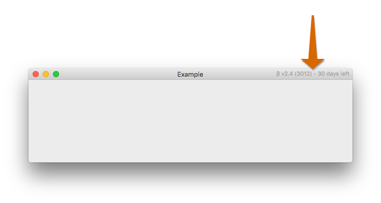

# BetaExpiration

Example showing how to implement a usable expiring beta to macOS apps.

## Setup

⚠️ **It doesn't make sense to put the example setup directly into your project.** 

That's because you frequently will want to modify `BetaExpiration.swift`. The library code has a hard-coded expiration date. You will want to change this with ongoing releases. To make this a Carthage or CocoaPods library would be useless.

There are two variants that'll work:

1. You can copy the files from the library over to your project.
2. You can check the whole project out (as a git submodule, for example) and include it as a sub-project in your app.

Whatever you do, it's important that you can easily change the expiration date in `BetaExpiration.swift`.

### Integration

1. Hard code a new expiration date in `BetaExpiration.expiresAt`. You can compute the date by running the unit tests and looking at the console output.
2. Change the alert in `BetaExpiration.guardExpiration()` to show your e-mail address.
3. Call `BetaExpiration.guardExpiration()` from your `AppDelegate`. This will display an alert and quit the app if the beta period is over.
4. _Optional:_ Decorate your app window with useful information for your beta testers, see below.

### Window decoration

    

The decoration is achieved by adding a `NSTitlebarAccessoryViewController` to the window. The format is as follows:

     β v1.2.0 (107) - 23 days left
         ^      ^     ^
         |      |     |__  = (today - expiration date)
         |      |
         |      |__ build number
         |
         |__ version

You get all of this by calling `BetaExpiration.decorate(window:hostBundle:)`. The `hostBundle` should be your app's main `Bundle` because that'll include version and build number information.

## Code License

Copyright (c) 2017-2019 Christian Tietze. Distributed under the MIT License.
